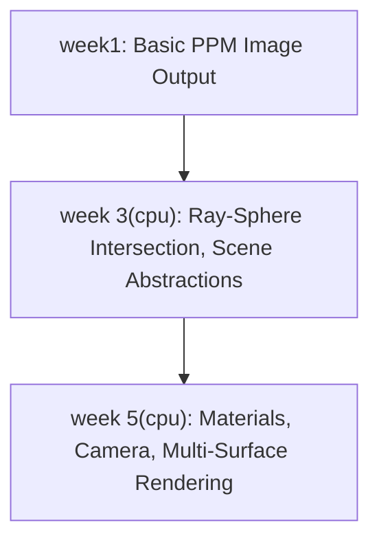

# CPU-based Ray Tracer (SOC 2025)

[](https://isocpp.org/std/the-standard "C++17 Standard")
[](https://www.gnu.org/software/make/ "Build with GNU Make")


---

## Table of Contents
- [Introduction & Motivation](#introduction--motivation)
- [Journey: Weekly Progression](#journey-weekly-progression)
- [Feature Comparison](#feature-comparison)
- [Features (Final: week5)](#features-final-week5)
  - [Limitations](#limitations)
- [Installation](#installation)
- [Usage](#usage)
- [Project Structure](#project-structure)
- [Build & Platform Notes](#build--platform-notes)
- [License](#license)
- [Roadmap / What’s Next?](#roadmap--whats-next)

---

## Introduction & Motivation

This project is a stepwise, educational implementation of a **CPU-based ray tracer**. Developed for the SOC 2025 program, it guides learners through the fundamentals of computer graphics, C++ programming, and physically-based rendering. Each folder (`week1`, `week 3(cpu)`, `week 5(cpu)`) represents a major learning milestone, culminating in a modular ray tracer capable of rendering scenes with realistic materials and lighting.

**Motivation:**
- To demystify the process of building a ray tracer from scratch.
- To provide a hands-on, incremental learning path for C++ and graphics.
- To serve as a foundation for future GPU-based or advanced rendering projects.

---

## Journey: Weekly Progression

> **Diagram:**
> - week1 → week 3(cpu) → week 5(cpu)
> - Each week builds on the last, adding new rendering and abstraction capabilities.



**Text fallback:**
- **week1:** Basic PPM image output (no ray tracing)
- **week 3(cpu):** Ray-sphere intersection, scene abstraction, simple shading
- **week 5(cpu):** Materials, camera, anti-aliasing, multi-surface rendering

### Output Images
- **week1:** [image.ppm](week1/image.ppm)  
- **week 3(cpu):** [image.ppm](week%203(cpu)/image.ppm)  
- **week 5(cpu):** [matte.ppm](week%205(cpu)/matte.ppm), [metal.ppm](week%205(cpu)/metal.ppm), [metal_fuzzed.ppm](week%205(cpu)/metal_fuzzed.ppm), [dielectric.ppm](week%205(cpu)/dielectric.ppm)

---

## Feature Comparison

| Feature                | week1 | week 3(cpu) | week 5(cpu) |
|------------------------|:-----:|:-----------:|:-----------:|
| PPM Output             |  ✅   |     ✅      |     ✅      |
| Color Gradient         |  ✅   |     ✅      |     ✅      |
| Ray Tracing            |  ❌   |     ✅      |     ✅      |
| Ray-Sphere Intersection|  ❌   |     ✅      |     ✅      |
| Scene Abstraction      |  ❌   |     ✅      |     ✅      |
| Multiple Objects       |  ❌   |     ✅      |     ✅      |
| Materials              |  ❌   |     ❌      |     ✅      |
| Metal/Dielectric       |  ❌   |     ❌      |     ✅      |
| Anti-Aliasing          |  ❌   |     ❌      |     ✅      |
| Recursive Bounces      |  ❌   |     ❌      |     ✅      |
| Camera Abstraction     |  ❌   |     ❌      |     ✅      |
| Multiple Output Images |  ❌   |     ❌      |     ✅      |

---

## Features (Final: week5)

### Technical Highlights
- **Physically-Based Materials:**
  - *Lambertian*: Diffuse reflection for matte surfaces.
  - *Metal*: Reflective surfaces with adjustable fuzziness.
  - *Dielectric*: Transparent materials with refraction (e.g., glass, bubbles).
- **Recursive Ray Tracing:**
  - Handles multiple bounces for realistic lighting.
  - Depth limit to control performance and quality.
- **Anti-Aliasing:**
  - Configurable samples per pixel for smooth, noise-free images.
- **Camera System:**
  - Adjustable aspect ratio, resolution, and sample count.
  - Generates rays with random subpixel sampling for realism.
- **Scene Abstraction:**
  - Easily add new objects and materials via `hittable_list` and `material` classes.
- **Output:**
  - Images in PPM format, viewable with standard image viewers or converters.

### Limitations
- No GPU acceleration (CPU-only implementation).
- No acceleration structures (e.g., BVH, grids) for large scenes.
- No texture mapping or complex lighting (e.g., area lights, global illumination).
- No support for mesh objects—only spheres.
- No GUI; output is PPM image files only.
- No parallelization/multithreading.

---

## Installation

### Prerequisites
- **Compiler:** g++ with C++17 support
- **Build Tool:** make
- **Tested Platforms:** macOS 14+, Linux (Ubuntu 20.04+)

### Build Steps
```sh
cd "week 5(cpu)"
make
```
This will produce a `main` executable in the `week 5(cpu)` directory.

### Clean Build
```sh
make clean
```

---

## Usage

1. **Run the Renderer (from `week 5(cpu)`):**
   ```sh
   ./main > output.ppm
   ```
   This will render the default scene and write the image to `output.ppm`.

2. **View the Output:**
   - Open `output.ppm` with an image viewer that supports PPM (e.g., GIMP, IrfanView, or convert to PNG with ImageMagick: `convert output.ppm output.png`).

3. **Modify the Scene:**
   - Edit `main.cpp` to change materials, objects, or camera settings.
   - Rebuild with `make` and rerun.

**Output files produced in week5:**
- `matte.ppm`, `metal.ppm`, `metal_fuzzed.ppm`, `dielectric.ppm` (example scenes)

---

## Project Structure

```
.
├── README.md
├── week1/
│   ├── main.cpp
│   ├── image.ppm
│   └── ...
├── week 3(cpu)/
│   ├── main.cpp
│   ├── image.ppm
│   ├── sphere.h
│   ├── hittable.h
│   ├── hittable_list.h
│   └── ...
└── week 5(cpu)/
    ├── main.cpp
    ├── matte.ppm
    ├── metal.ppm
    ├── metal_fuzzed.ppm
    ├── dielectric.ppm
    ├── camera.h
    ├── material.h
    ├── sphere.h
    ├── hittable.h
    ├── hittable_list.h
    └── ...
```

### Key Files
- **main.cpp:** Entry point; sets up the scene, camera, and triggers rendering.
- **camera.h:** Camera abstraction, ray generation, anti-aliasing.
- **material.h:** Material system (Lambertian, Metal, Dielectric).
- **sphere.h:** Sphere primitive and intersection logic.
- **hittable.h / hittable_list.h:** Scene and object abstraction.
- **color.h, vec3.h, ray.h, interval.h, constants.h:** Math and utility helpers.
- **Makefile:** Build instructions for each week’s implementation.

---

## Build & Platform Notes
- **Supported OS:** macOS (tested on 14.5+), Linux (Ubuntu 20.04+). Windows may require minor Makefile/C++ tweaks.
- **Dependencies:**
  - Standard C++17 compiler (g++ recommended)
  - GNU Make
  - No external libraries required

---

## License

This project is shared for educational purposes. You are welcome to use, modify, and extend it freely for your own learning or research. No formal restrictions, attribution, or permissions are required—just enjoy, experiment, and grow your understanding of computer graphics!

---

## Roadmap / What’s Next?
- **GPU Acceleration:** CUDA,OpenCL,SYCL or Vulkan backend for real-time performance.
- **Acceleration Structures:** BVH, grids, or k-d trees for faster intersection tests.
- **New Primitives:** Support for planes, triangles, and mesh loading.
- **Texture Mapping:** Image-based and procedural textures.
- **Lighting Models:** Area lights, soft shadows, global illumination.
- **Parallelization:** Multi-threaded CPU rendering.
- **User Interface:** Simple GUI for scene/camera/material editing.
- **Testing & CI:** Automated tests and continuous integration.

---

*For questions, suggestions, or contributions, please open an issue or pull request!* 
